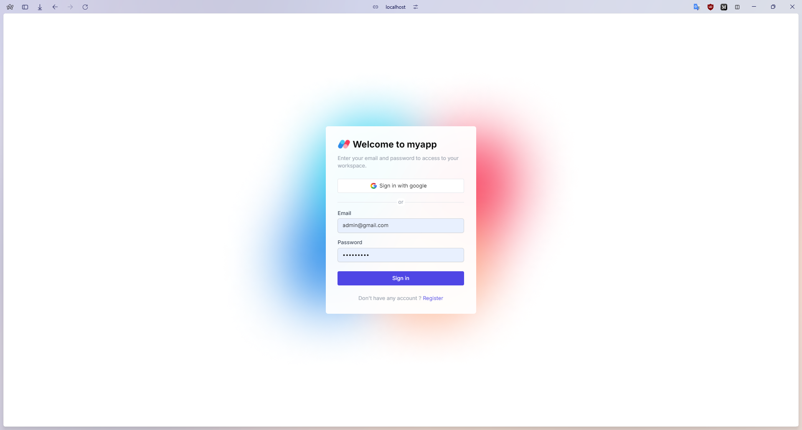
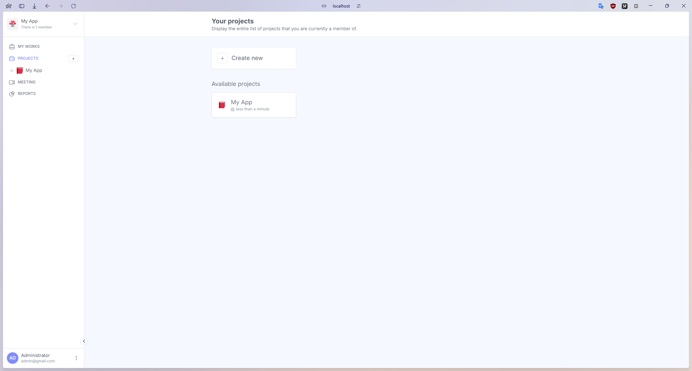
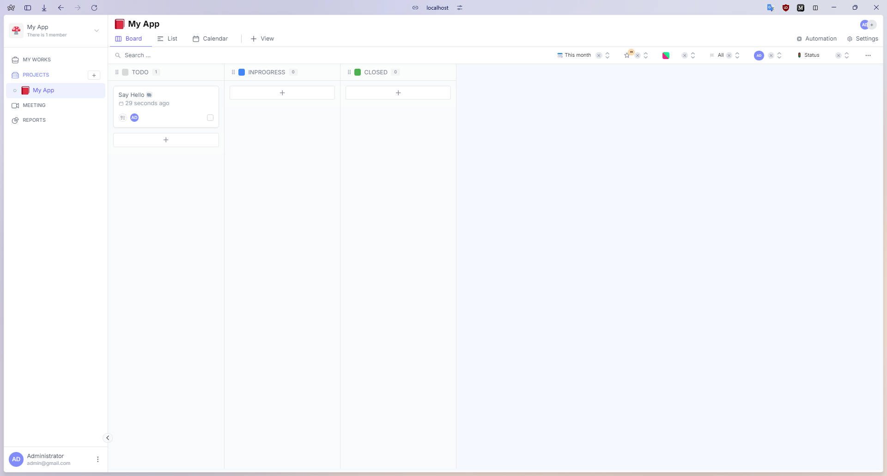
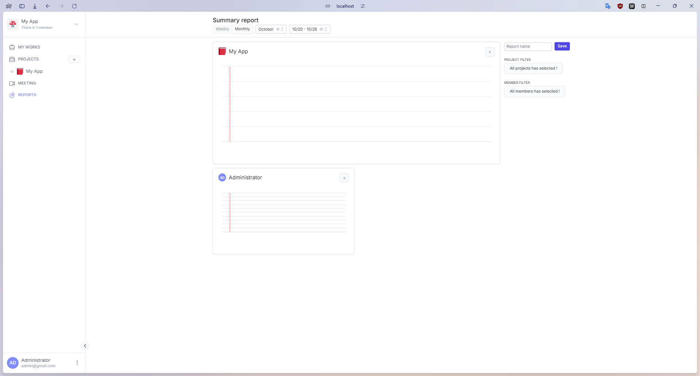

## SnapShot

SnapShot is a web application that allows you to take a screenshot of a website and save it to your account. You can also share the screenshot with others.

<div style="display: grid; grid-template-columns: repeat(2, 1fr); gap: 10px;">
  
  
  
  
</div>

## What tech stack I use

- Next.js
- Node.js
- MongoDB
- Redis

## What features are packed in ?

## How to use it

### Run with docker

```
cp .env.example .env.local
yarn compose-build
yarn compose-up
```
